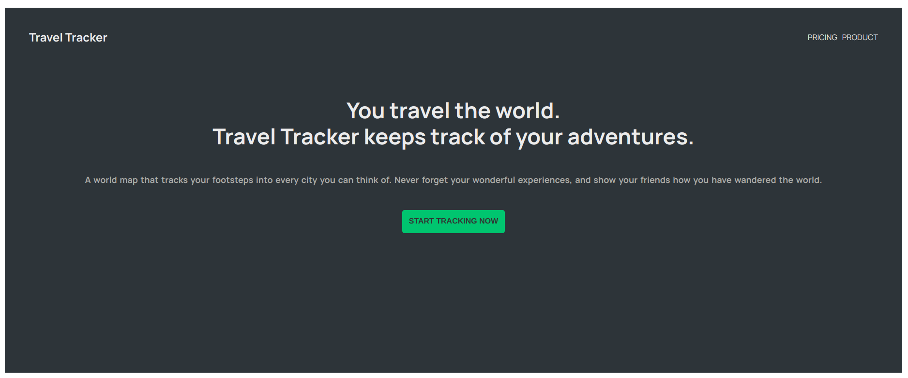
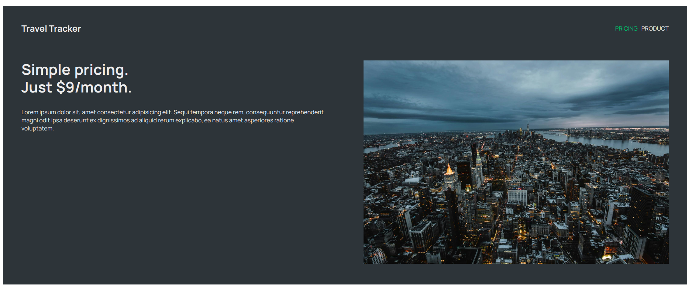
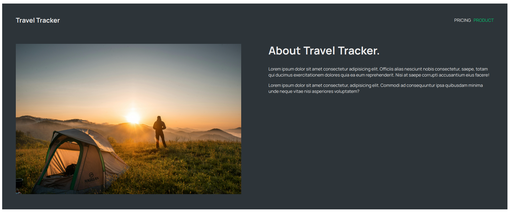
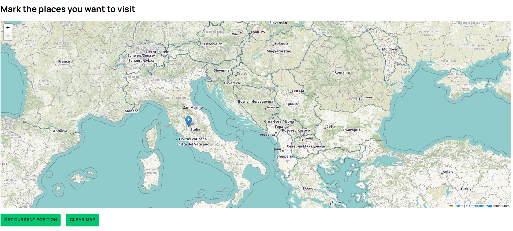

# Travel Tracker

Travel Tracker is a simple web application that allows you to track your travels by marking locations on a map. You can get your current position, add markers manually by clicking on the map, and clear all markers. This project uses React and Leaflet.

## Features

- Get current geographical position and mark it on the map.
- Add markers to the map by clicking.
- Clear all markers from the map.

## Screenshots









## Installation

1. Clone the repository:

   ```bash
   git clone https://github.com/lucchesilorenzo/travel-tracker.git
   cd travel-tracker
   ```

2. Install dependencies:

   ```bash
   npm install
   ```

3. Start the development server:
   ```bash
   npm run dev
   ```
